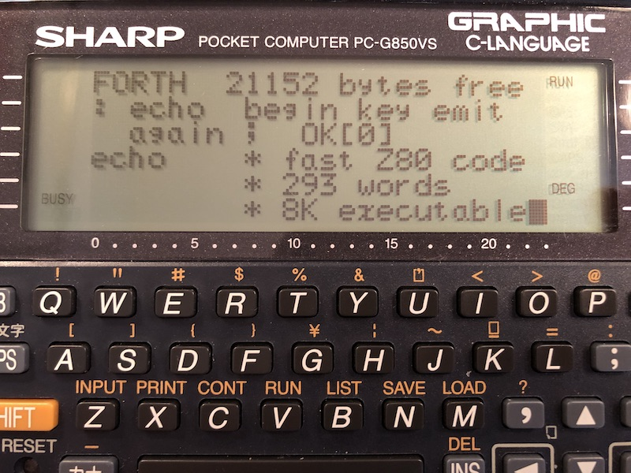

A modern Forth 2012 standard compliant system for the vintage SHARP
PC-G850(V)(S) pocket computer.

You can extend Forth850 as you wish, including assembly code written on the
machine itself in the TEXT editor and assembled with the built-in Z80
Assembler.  See [ASMDEMO1.FTH](examples/ASMDEMO1.FTH) for an example with an
explanation how this works.

You can write Forth source code in the built-in TEXT editor and read it back
into Forth850 with the [TEXT](examples/TEXT.FTH) word.

I've implemented Forth850 as efficiently as possible in direct threaded code
(DTC) with brand new Z80 code written from scratch.  See the
[technical implementation sections](#Implementation) why Forth850 is fast for a
DTC implementation.  The [Forth850 source code](forth850.asm) is included and
heavily documented.

The [n-queens benchmark](https://www.hpmuseum.org/cgi-sys/cgiwrap/hpmuseum/articles.cgi?read=700)
is solved in 0.865 seconds, the fastest Forth implementation of the benchmarks.
Forth850 n-queens runs 5 times faster than the C n-queens benchmark on the
PC-G850VS.

Forth850 includes stack under/overflow checks, dictionary overflow checks and
can be interrupted by pressing BREAK.

Discuss: [HP Forum](https://www.hpmuseum.org/forum/thread-19085.html) and [reddit](https://www.reddit.com/r/Forth/comments/ytat79/a_fast_forth_for_vintage_sharp_pcg850_pocket)

## Installation

In RUN MODE enter `MON` to enter the Monitor, then enter `USER3FFF` to reserve
16K memory space:

    *USER3FFF
    FREE:0100-3FFF

Press `BASIC` to return to RUN MODE.  Load forth850.wav using a cassette
interface CE-126P or a CE-124:

    BLOADM

Loading via serial is in principle possible.  Instructions will be included
in this README sometime later.

Load the forth850-full.wav "full version" to include many
[additional words](#additional-words-included-with-the-full-version).
The full version will continue to evolve and grow with new features.

## How to switch between Forth and BASIC

To return to Forth, enter `CALL256` in RUN MODE.

To return to BASIC from Forth, press the BASIC key.  The TEXT key takes you to
the TEXT editor.

To turn the machine off, press the OFF key.  The machine will also power off
automatically after about 10 minutes waiting for user input at the prompt.

## How to increase or decrease memory allocation for Forth850

Memory allocation can be adjusted without affecting the Forth dictionary.

In RUN MODE enter `MON` to enter the Monitor, then enter `USERaddr` with an
upper address `addr` larger than `23ff` (9K bytes.)  If words are added to
Forth850, you must make sure that `addr` is large enough by calculating the
`addr` as follows:

    HERE #708 + HEX . DECIMAL
    23FF

In the Monitor specify `USERaddr` with the address displayed.  This leaves
about 200 bytes free dictionary space minus 40 bytes for the "hold area" to run
Forth850.  The largest size is `USER75FF` which gives about 21K free dictionary
space (but there won't be space left on the machine for files, BASIC or TEXT.)

## Nice to have (work in progress)

- an additional extended "full version" with additional Forth words
- with an improved command line editor, like Forth500
- with single precision floating point words
- serial IO to communicate via RS232 and load source code
- DONE: ability to [load Forth source code from the TEXT editor](examples/TEXT.FTH)
- DONE: sound with [BEEP](examples/ASMDEMO1.FTH)

## Forth850 manual

Forth850 is 2012 standard compliant.  For help, see the manual included with
[Forth for the Sharp PC-E500(S)](https://github.com/Robert-van-Engelen/Forth500)
and [Forth 2012 Standard](https://forth-standard.org/standard/intro).

Forth850 implements a subset of the standard Forth words.  A list of Forth850
words with an explanation is given below.

## Forth850 words

List of Forth850 built-in words.  Reference implementations in Forth are
included when applicable, although many words are implemented in Z80 code for
speed rather than in Forth.

### (:)
_-- ; R: -- ip_
call colon definition;
runtime of the : compile-only word

### (;)
_-- ; R: ip --_
return to caller from colon definition;
runtime of the ; compile-only word

### (EXIT)
_-- ; R: ip --_
return to caller from colon definition;
runtime of the EXIT compile-only word

### (;CODE)
_-- ; R: ip --_
set LASTXT cfa to ip and return from colon definition;
a runtime word compiled by the DOES> compile-only word

### (DOES)
_addr -- addr ; R: -- ip_
calls the DOES> definition with pfa addr;
a runtime word compiled by the DOES> compile-only word coded as call dodoes

### (VAR)
_-- addr_
leave parameter field address (pfa) of variable;
runtime word of a VARIABLE coded as call dovar

### (VAL)
_-- x_
fetch value;
runtime word of a VALUE coded as call doval

### (2VAL)
_-- dx_
fetch double value;
runtime word of a 2VALUE coded as call dotwoval

### (CON)
_-- x_
fetch constant;
runtime word of a CONSTANT coded as call docon

### (2CON)
_-- x_
fetch double constant;
runtime word of a 2CONSTANT coded as call dotwocon

### (DEF)
_--_
execute deferred word;
runtime word of a DEFER coded as call dodef

### (LIT)
_-- x_
fetch literal;
runtime word compiled by EVALUATE, INTERPRET and NUMBER

### (2LIT)
_-- x1 x2_
fetch double literal;
runtime word compiled by EVALUATE, INTERPRET and NUMBER

### (SLIT)
_-- c-addr u_
fetch literal string;
runtime word compiled by S" and ."

### 0
_-- 0_
leave constant 0

    0 CONSTANT 0

### 1
_-- 1_
leave constant 1

    1 CONSTANT 1

### -1
_-- -1_
leave constant -1

    -1 CONSTANT -1

### BL
_-- 32_
leave constant 32 (space)

    #32 CONSTANT BL

### PAD
_-- c-addr_
leave address of the PAD;
the PAD is a free buffer space of 256 bytes not used by Forth850

### TIB
_-- c-addr_
leave address of TIB;
the terminal input buffer used by Forth850

### TMP
_-- c-addr_
leave address of the next temp string buffer;
switches between two string buffers of 256 free bytes each;
used by S" to store a string when interpreting

### DROP
_x --_
drop TOS

### DUP
_x -- x x_
duplicate TOS

### ?DUP
_x -- x x or 0 -- 0_
duplicate TOS if nonzero

### SWAP
_x1 x2 -- x2 x1_
swap TOS with 2OS

### OVER
_x1 x2 -- x1 x2 x1_
copy 2OS over TOS

### ROT
_x1 x2 x3 -- x2 x3 x1_
rotate cells

    : ROT >R SWAP R> SWAP ;

### -ROT
_x1 x2 x3 -- x3 x1 x2_
undo (or left) rotate cells

    : -ROT ROT ROT ;

### NIP
_x1 x2 -- x2_
nip 2OS

    : NIP SWAP DROP ;

### TUCK
_x1 x2 -- x2 x1 x2_
tuck TOS under 2OS

    : TUCK SWAP OVER ;

### 2DROP
_xd1 xd2 -- xd1_
drop double TOS

    : 2DROP DROP DROP ;

### 2DUP
_xd -- xd xd_
duplicate double TOS

    : 2DUP OVER OVER ;

### 2SWAP
_xd1 xd2 -- xd2 xd1_
swap double TOS with double 2OS

    : 2SWAP ROT >R ROT R> ;
    : 2SWAP 3 ROLL 3 ROLL ;

### 2OVER
_xd1 xd2 -- xd1 xd2 xd1_
copy double 2OS over double TOS

    : 2OVER >R >R 2DUP R> R> 2SWAP ;
    : 2OVER 3 PICK 3 PICK ;

### DEPTH
_-- u_
parameter stack depth

    : DEPTH sp0 @ SP@ - 2- 2/ ;

### CLEAR
_... --_
purge parameter stack

    : CLEAR sp0 @ SP! ;

### .S
_--_
display parameter stack

    : .S DEPTH 0 ?DO sp0 @ I 2+ CELLS - ? LOOP ;

### SP@
_-- addr_
fetch stack pointer

### SP!
_addr --_
store stack pointer

### >R
_x -- ; R: -- x_
move TOS to the return stack

### DUP>R
_x -- x ; R: -- x_
duplicate TOS to the return stack, a single word for DUP >R

### R>
_R: x -- ; -- x_
move cell from the return stack

### RDROP
_R: x -- ; --_
drop cell from the return stack, a single word for R> DROP

### R@
_R: x -- x ; -- x_
fetch cell from the return stack

### 2>R
_x1 x2 -- ; R: -- x1 x2_
move double TOS to the return stack, a single word for SWAP >R >R

### 2R>
_R: x1 x2 -- ; -- x1 x2_
move double cell from the return stack, a single word for R> R> SWAP

### 2R@
_R: x1 x2 -- x1 x2 ; -- x1 x2_
fetch double cell from the return stack

### RP@
_-- addr_
fetch return stack pointer

### RP!
_addr --_
store return stack pointer

### PICK
_xu ... x0 u -- xu ... x0 xu_
pick u'th cell from the parameter stack;
0 PICK is the same as DUP;
1 PICK is the same as OVER

    : PICK 1+ CELLS SP@ + @ ;

### @
_addr -- x_
fetch from cell

### C@
_c-addr -- char_
fetch char

### 2@
_addr -- x1 x2_
fetch from double cell

    : 2@ DUP CELL+ @ SWAP @ ;

### !
_x addr --_
store in cell

### (TO)
_x --_
store in value;
runtime of the TO compile-only word

### C!
_char c-addr --_
store char

### 2!
_x1 x2 addr --_
store in double cell

    : 2! TUCK ! CELL+ ! ;

### (2TO)
_dx --_
store in double value;
runtime of the TO compile-only word

### +!
_n addr --_
increment cell

### (+TO)
_n --_
increment value;
runtime of the +TO compile-only word

### ON
_addr --_
store TRUE (-1) in cell

    : ON -1 SWAP ! ;

### OFF
_addr --_
store FALSE (0) in cell

    : OFF 0 SWAP ! ;

### +
_n1 n2 -- n3_
sum n1+n2

### M+
_d1 n -- d2_
double sum d1+n

### D+
_d1 d2 -- d3_
double sum d1+d2

    : D+ >R M+ R> + ;

### -
_n1 n2 -- n3_
difference n1-n2

### D-
_d1 d2 -- d3_
double difference d1-d2

    : D- DNEGATE D+ ;

### UM*
_u1 u2 -- ud_
unsigned double product u1*u2

### M*
_n1 n2 -- d_
signed double product n1*n2

    : M*
      2DUP XOR >R
      ABS SWAP ABS UM*
      R> 0< IF DNEGATE THEN ;

### *
_n1|u1 n2|u2 -- n3|u3_
signed and unsigned product n1*n2

    : * UM* DROP ;

### UMD*
_ud1 u -- ud2_
unsigned double product ud1*u

    : UMD* DUP>R UM* DROP SWAP R> UM* ROT + ;

### MD*
_d1 n -- d2_
signed double product d1*n

    : MD*
      2DUP XOR >R
      ABS -ROT DABS ROT
      UMD*
      R> 0< IF DNEGATE THEN ;

### UM/MOD
_ud u1 -- u2 u3_
remainder and quotient ud/u1;
the result is undefined when u1 = 0

### SM/REM
_d1 n1 -- n2 n3_
symmetric signed remainder and quotient d1/n1;
the result is undefined when n1 = 0

    : SM/REM
      2DUP XOR >R
      OVER >R
      ABS >R
      DABS R> UM/MOD
      SWAP
      R> 0< IF NEGATE THEN
      SWAP
      R> 0< IF NEGATE THEN ;

### FM/MOD
_d1 n1 -- n2 n3_
floored signed modulus and quotient d1/n1;
the result is undefined when n1 = 0

    : FM/MOD
      DUP>R
      SM/REM
      DUP 0< IF
        SWAP R> + SWAP 1-
      ELSE
        RDROP
      THEN ;

### /MOD
_n1 n2 -- n3 n4_
signed symmetric remainder and quotient n1/n2;
the result is undefined when n2 = 0

    : /MOD SWAP S>D ROT SM/REM ;

### MOD
_n1 n2 -- n3_
signed symmetric remainder of n1/n2;
the result is undefined when n2 = 0

    : / /MOD DROP ;

### /
_n1 n2 -- n3_
signed symmetric quotient n1/n2;
the result is undefined when n2 = 0

    : / /MOD NIP ;

### */MOD
_n1 n2 n3 -- n4 n5_
signed product symmetric remainder and quotient n1*n2/n3;
the result is undefined when n3 = 0

    : */MOD -ROT M* ROT SM/REM ;

### */
_n1 n2 n3 -- n4_
signed product symmetric quotient n1*n2/n3;
the result is undefined when n3 = 0

    : */ */MOD NIP ;

### M*/
_d1 n1 n2 -- d2_
signed double product symmetric quotient d1*n1/n2;
the result is undefined when n2 = 0

    : M*/ >R MD* R> SM/REM NIP ;

### AND
_x1 x2 -- x1&x2_
bitwise and x1 with x2

### OR
_x1 x2 -- x1|x2_
bitwise or x1 with x2

### XOR
_x1 x2 -- x1^x2_
bitwise xor x1 with x2

### =
_x1 x2 -- flag_
true if x1 = x2

### <>
_x1 x2 -- flag_
true if x1 <> x2

### <
_n1 n2 -- flag_
true if n1 < n2 signed

    : <
      2DUP XOR 0< IF
        DROP 0<
        EXIT
      THEN
      - 0< ;

### >
_n1 n2 -- flag_
true if n1 > n2 signed

    : > SWAP < ;

### U<
_u1 u2 -- flag_
true if u1 < u2 unsigned

    : U<
      2DUP XOR 0< IF
        NIP 0<
        EXIT
      THEN
      - 0< ;

### U>
_u1 u2 -- flag_
true if u1 > u2 unsigned

    : U> SWAP U< ;

### 0=
_x -- flag_
true if x = 0

### 0<
_n -- flag_
true if n < 0

### D0=
_dx -- flag_
true if dx = 0

    : D0= OR 0= ;

### D0<
_d -- flag_
true if d < 0

    : D0< NIP 0< ;

### S>D
_n -- d_
widen n to a double

### D>S
_d -- n_
narrow d to a single;
may throw -11 "result out of range" valid range is -32768 to 65535

### MAX
_n1 n2 -- n3_
signed max of n1 and n2

    : MAX
      2DUP < IF SWAP THEN
      DROP ;

### MIN
_n1 n2 -- n3_
signed min of n1 and n2

    : MIN
      2DUP > IF SWAP THEN
      DROP ;

### UMAX
_u1 u2 -- u3_
unsigned max of u1 and u2

    : UMAX
      2DUP U< IF SWAP THEN
      DROP ;

### UMIN
_u1 u2 -- u3_
unsigned min of u1 and u2

    : UMIN
      2DUP U> IF SWAP THEN
      DROP ;

### WITHIN
_x1 x2 x3 -- flag_
true if x1 is within x2 up to x3 exclusive

    : WITHIN OVER - >R - R> U< ;

### INVERT
_x1 -- x2_
one's complement ~x

    : INVERT 1+ NEGATE ;

### NEGATE
_n1 -- n2_
two's complement -n

### ABS
_n1 -- n2_
absolute value |n1|

    : ABS DUP 0< IF NEGATE THEN ;

### DNEGATE
_d1 -- d2_
two's complement -d1

    : DNEGATE SWAP INVERT SWAP INVERT 1 M+ ;

### DABS
_d1 -- d2_
absolute value |d1|

    : DABS DUP 0< IF DNEGATE THEN ;

### LSHIFT
_x1 u -- x2_
logical shift left x1 << u

### RSHIFT
_x1 u -- x2_
logical shift right x1 >> u

### 1+
_n1 -- n2_
increment n1+1

    : 1+ 1 + ;

### 2+
_n1 -- n2_
increment n1+2

    : 2+ 2 + ;

### 1-
_n1 -- n2_
decrement n1-1

    : 1- 1 - ;

### 2-
_n1 -- n2_
decrement n1-2

    : 2- 2 - ;

### 2*
_n1 -- n2_
arithmetic shift left n1 << 1

    : 2* 2 * ;

### 2/
_n1 -- n2_
arithmetic shift right n1 >> 1

    : 2/ 2 / ;

### COUNT
_c-addr1 -- c-addr2 u_
convert counted string to string

    : COUNT DUP 1+ SWAP C@ ;

### COMPARE
_c-addr1 u1 c-addr2 u2 -- -1|0|1_
compare strings, leaves -1 = less or 0 = equal or 1 = greater

### S=
_c-addr1 u1 c-addr2 u2 -- flag_
true if strings match

    : S= COMPARE 0= ;

### SEARCH
_c-addr1 u1 c-addr2 u2 -- c-addr3 u3 flag_
true if the second string is in the first;
leaves matching address, remaining length and true;
or leaves the first string and false

### CMOVE
_c-addr1 c-addr2 u --_
move u bytes from c-addr1 to c-addr2 (from begin)

    : CMOVE
      SWAP >R
      BEGIN DUP WHILE
        NEXT-CHAR R@ C!
        R> 1+ >R
      REPEAT
      RDROP
      2DROP ;

### CMOVE>
_c-addr1 c-addr2 u --_
move u bytes from c-addr1 to c-addr2 up (from end)

### MOVE
_c-addr1 c-addr2 u --_
move u bytes from c-addr1 to c-addr2

    : MOVE
      -ROT
      2DUP U< IF
        ROT CMOVE>
      ELSE
        ROT CMOVE
      THEN ;

### FILL
_c-addr u char --_
fill memory with char

### ERASE
_c-addr u --_
fill memory with zeros

    : ERASE 0 FILL ;

### BLANK
_c-addr u --_
fill memory with 0x20 (bl) chars

    : ERASE BL FILL ;

### CHOP
_c-addr u1 char -- c-addr u2_
truncate string up to matching char;
leaves string if char not found;
char = 0x20 (bl) chops 0x00 to 0x20 (white space and control)

### TRIM
_c-addr1 u1 char -- c-addr2 u2_
trim initial chars;
char = 0x20 (bl) trims 0x00 to 0x20 (white space and control)

### -TRIM
_c-addr u1 char -- c-addr u2_
trim trailing chars;
char = 0x20 (bl) trims 0x00 to 0x20 (white space and control)

### -TRAILING
_c-addr u1 -- c-addr u2_
trim trailing white space and control characters

    : -TRAILING BL -TRIM ;

### /STRING
_c-addr1 u1 n -- c-addr2 u2_
slice n characters off string

    : /STRING ROT OVER + -ROT - ;

### NEXT-CHAR
_c-addr1 u1 -- c-addr2 u2 char_
get next char from string

    : NEXT-CHAR OVER C@ >R 1- SWAP 1+ SWAP R> ;
    : NEXT-CHAR OVER C@ -ROT 1- SWAP 1+ SWAP ROT ;

### X!
_u --_
set cursor column 0 to 23

### Y!
_u --_
set cursor row 0 to 5

### X@
_-- u_
fetch cursor column

### Y@
_-- u_
fetch cursor row

### AT-XY
_u1 u2 --_
set column x to u1 (0 to 23) and row y to u2 (0 to 5)

    : AT-XY Y! X! ;

### EMIT
_char --_
emit char;
supports the following control codes:
 8 (BS)
 9 (TAB)
10 (LF)
11 (VT scroll)
12 (FF clear)
13 (CR)
28 (right)
29 (left)
30 (up)
31 (down)

### TYPE
_c-addr u --_
type string to output

    : TYPE
      BEGIN DUP WHILE
        NEXT-CHAR EMIT
      REPEAT
      2DROP ;

### CR
_--_
carriage return and line feed

    : CR $A EMIT ;

### SPACE
_--_
emit a space (BL)

    : SPACE BL EMIT ;

### SPACES
_n --_
emit n spaces

    : SPACES
      DUP 0< IF
        DROP
        EXIT
      THEN
      0 ?DO SPACE LOOP ;

### PAGE
_--_
clear screen

    : PAGE $C EMIT ;

### BASE
_-- addr_
variable with numeric base for conversion

    VARIABLE BASE

### DECIMAL
_--_
set BASE to 10

    : DECIMAL #10 BASE ! ;

### HEX
_--_
set BASE to 16

    : HEX #16 BASE ! ;

### HP
_-- addr_
hold pointer

    0 VALUE HP

### <#
_--_
begin pictured numeric output

    : <# HERE h_size + TO HP ;

### HOLD
_char --_
hold char for pictured numeric output

    : HOLD HP 1- DUP TO HP C! ;

### #
_ud1 -- ud2_
hold digit

    : #
      0 BASE @ UM/MOD >R
      BASE @ UM/MOD
      SWAP DUP #9 > IF
        #7 +
      THEN
      '0 + HOLD
      R> ;

### #S
_ud -- 0 0_
hold all remaining digits

    : #S BEGIN # 2DUP D0= UNTIL ;

### SIGN
_n --_
hold minus sign if n < 0

    : SIGN 0< IF '- HOLD THEN ;

### #>
_ud -- c-addr u_
end pictured numeric output, leave string

    : #> 2DROP HP HERE h_size + OVER - ;

### D.R
_d +n --_
output signed double d right aligned in field of +n chars wide

    : D.R -ROT TUCK DABS <# #S ROT SIGN #> ROT OVER - SPACES TYPE ;

### D.
_d --_
output signed double d with space

    : D. 0 D.R SPACE ;

### U.R
_u +n --_
output unsigned u right aligned in field of +n chars wide

    : U.R 0 SWAP D.R ;

### U.
_u --_
output unsigned u with space

    : U. 0 D. ;

### .R
_n +n --_
output signed n right aligned in field of +n chars wide

    : .R SWAP S>D ROT D.R ;

### .
_n --_
output signed n with space

    : . S>D D. ;

### ?
_addr --_
output signed cell stored at addr

    : ? @ . ;

### OUT
_u1 u2 --_
output byte u1 to port u2

### INP
_u1 -- u2_
input from port u1

### DRAW
_c-addr u --_
draw pixel patterns on screen at xy;
writes string c-addr u of pixel patterns at xy;
specify xy with AT-XY, xy not changed after DRAW

### VIEW
_c-addr u --_
view screen pixels at xy;
read string of screen pixel patterns at xy into buffer c-addr u
specify xy with AT-XY, xy not changed after VIEW

### REVERSE
_+n --_
reverse video of the +n characters displayed at xy;
specify xy with AT-XY

### INKEY
_-- x_
check key, where 0x00 = no key and 0x52 = multiple keys

### GETKEY
_-- char_
wait and read key;
leaves ASCII char or special key code:
ON      =$05
BS      =$08
DEL     =$09
CA      =$0b
CLS     =$0c
ENTER   =$0d
DIGIT   =$0e
F-E     =$0f
INS     =$12
ANS     =$15
CONST   =$17
RCM     =$19
M+      =$1a
M-      =$1b
right   =$1c
left    =$1d
up      =$1e
down    =$1f;
calc keys and BASIC keys produce BASIC tokens as key code $fe:
SIN     =$fe register B = $95 BASIC token for SIN (ignored)

### KEY
_-- char_
display cursor and wait to read key;
same as GETKEY leaves ASCII char or special key code

### EDIT
_c-addr +n1 n2 n3 n4 -- c-addr +n5_
edit buffer c-addr;
buffer size +n1;
string in buffer has length n2;
place cursor at n3;
non-editable left margin n4;
leaves c-addr and length +n5

### ACCEPT
_c-addr +n1 -- +n2_
accept user input into buffer c-addr +n1;
leaves length +n2

    : ACCEPT 0 0 0 EDIT NIP ;

### >IN
_-- addr_
variable with offset into input buffer (TIB)

    VARIABLE >IN

### SOURCE-ID
_-- 0|-1_
value with 0 = source input or -1 = string input

    0 VALUE SOURCE-ID

### SOURCE
_-- c-addr u_
double value with input source

    TIB 0 2VALUE SOURCE

### REFILL
_-- flag_
attempt to refill the input buffer;
leaves false when end of input

### SKIPS
_char "<chars>" --_
skips chars in input, 0x20 (bl) skips 0x00 to 0x20

    : SKIPS SOURCE >IN @ /STRING ROT TRIM DROP SOURCE DROP - >IN ! ;

### PARSE
_char "ccc<char>" -- c-addr u_
parse "ccc" up to char when present

    : PARSE SOURCE >IN @ /STRING ROT CHOP DUP 1+ >IN @ + SOURCE NIP UMIN >IN ! ;

### PARSE-WORD
_char "<chars>ccc<char>" -- c-addr u_
parse char-delimited word;
may throw -18 "parsed string overflow"

    : PARSE-WORD
      DUP SKIPS PARSE
      DUP tmp_size-1 U> IF -18 THROW THEN ;

### CHECK-NAME
_c-addr u -- c-addr u_
check if name is valid;
may throw -16 "attempt to use a zero-length string as a name";
may throw -19 "definition name too long"

    : CHECK-NAME
      DUP 0= IF -16 THROW THEN
      DUP length_bits U> IF -19 THROW THEN ;

### PARSE-NAME
_"<spaces>name<space>" -- c-addr u_
parse space-delimited name;
check if name length is valid

    : PARSE-NAME BL PARSE-WORD CHECK-NAME ;

### (
_"ccc<paren>" --_
start a comment block;
parse and skip input up to the closing )

    : (
      ') PARSE
      BEGIN
        + DROP
        SOURCE + = IF
          DROP REFILL
        ELSE
          C@ ') <> IF
            REFILL
          ELSE
            FALSE
          THEN
        THEN
      0= UNTIL ; IMMEDIATE

### \
_"ccc<eol>" --_
start a comment line;
parse and skip input up to the end of line;
note that the PC-G850 symbol for \ is ¥

    : \ $A PARSE 2SROP ;

### .(
_"ccc<paren>" --_
emit CR then type "ccc" up to the closing )

    : .( ') PARSE CR TYPE ; IMMEDIATE

### >DIGIT
_char -- n_
convert char digit to numeric digit when within BASE;
leaves -1 if char is invalid

### >NUMBER
_ud1 c-addr1 u1 -- ud2 c-addr2 u2_
convert string to number;
updates accumulated double ud1 to ud2;
leaves string with the remaining unconvertable chars or empty

    : >NUMBER
      BEGIN DUP WHILE
        NEXT-CHAR >DIGIT
        DUP 0< IF
          DROP -1 /STRING
          EXIT
        THEN
        >R
        2SWAP
        BASE @ UMD*
        R> M+
        2SWAP
      REPEAT ;

### DBL
_-- flag_
true if >DOUBLE or NUMBER produced a double

    0 VALUE DBL

### >DOUBLE
_c-addr u -- d true | false_
convert string to signed double;
leaves true if string is converted;
leaves false if string is unconvertable

### L>NAME
_lfa -- nt_
convert link field address to name token (nfa)

### NAME>STRING
_nt -- c-addr u_
convert name token (nfa) to string

### NAME>
_nt -- xt_
convert name token (nfa) to execution token (cfa)

### >NAME
_xt -- nt_
convert execution token (cfa) to name token (lfa);
may throw -24 "invalid numeric argument"

### >BODY
_xt -- pfa_
convert execution token to parameter field address

### FIND-WORD
_c-addr u -- c-addr 0 | xt 1 | xt -1_
search dictionary for matching word;
leaves execution token and 1 = immediate or -1 = not immediate;
leaves c-addr and 0 when not found

### '
_"<spaces>name<space>" -- xt_
parse name and get execution token;
may throw -13 "undefined word"

    : ' PARSE-NAME FIND-WORD 0= IF -13 THROW THEN ;

### WORDS
_--_
display context vocabulary words

### HERE
_-- addr_
address of free memory after the dictionary;
new definitions are added here;
note that numeric output words use HERE for conversion

### LASTXT
_-- xt_
leaves the last execution token defined

    0 VALUE LASTXT

### STATE
_-- addr_
compilation state;
STATE @ leaves TRUE when compiling;
STATE @ leaves FALSE when interpreting

    VARIABLE STATE

### [
_--_
switch state to interpreting

    : [ STATE OFF ;

### ]
_--_
switch state to compiling

    : ] STATE ON ;

### HIDE
_--_
hide the last definition

    : HIDE CURRENT @ L>NAME DUP C@ smudge_bits OR SWAP C! ;

### REVEAL
_--_
reveal the last definition

    : REVEAL CURRENT @ L>NAME DUP C@ ~smudge_bits AND SWAP C! ;

### IMMEDIATE
_--_
make the last definition immediate

    : IMMEDIATE CURRENT @ L>NAME DUP C@ immediate_bits OR SWAP C! ;

### ?COMP
_--_
check if compiling;
may throw -14 "interpreting a compile-only word"

### ?SYS
_-- ; C: x --_
check if compiled control structure matches x;
may throw -14 "interpreting a compile-only word";
may throw -22 "control structure mismatch"

### UNUSED
_-- u_
unused dictionary space

    : UNUSED top @ HERE - ;

### ALLOT
_n --_
allocate n bytes starting from HERE in the dictionary;
undo the last ALLOT with negative n;
may throw -8 "dictionary overflow"

### COMPILE,
_xt --_
append execution token to dictionary;
may throw -8 "dictionary overflow"

    : COMPILE, , ;

### ,
_x --_
append cell to dictionary;
may throw -8 "dictionary overflow"

### C,
_char --_
append char to dictionary;
may throw -8 "dictionary overflow"

### 2,
_x1 x2 --_
append double cell to dictionary;
may throw -8 "dictionary overflow"

    : 2, , , ;

### NFA,
_"<spaces>name<space>" --_
parse name and append dictionary entry with name;
set LASTXT to HERE;
may throw -8 "dictionary overflow"

    : NFA, PARSE-NAME HERE CURRENT @ , CURRENT ! DUP C, HERE SWAP DUP ALLOT CMOVE HERE TO LASTXT ;

### CFA,
_addr --_
append cfa call addr to dictionary;
may throw -8 "dictionary overflow"

### CFA:,
_-- addr colon_sys_
append cfa colon definition to dictionary;
make CONTEXT the CURRENT vocabulary;
start compiling;
may throw -8 "dictionary overflow"

    : CFA:, ] HERE colon_sys ['] (:) CFA, CURRENT TO CONTEXT ;

### POSTPONE
_"<spaces>name<space>" --_
postpone compile action of name;
if name is immediate, then compile name instead of executing it;
otherwise compile name into the current colon definition;
can be used to create macros, e.g. : TRUE POSTPONE -1 ; IMMEDIATE;
may throw -13 "undefined word";
may throw -14 "interpreting a compile-only word"

### :
_-- ; C: "<spaces>name<space>" -- addr colon_sys_
define name and start compiling

    : : NFA, HIDE CFA:, ;

### ;
_-- ; C: addr colon_sys --_
end colon definition and stop compiling;
may throw -14 "interpreting a compile-only word";
may throw -22 "control structure mismatch"

    : ; ?COMP colon_sys <> IF -22 THROW THEN DROP POSTPONE (;) REVEAL [ ; IMMEDIATE

### EXIT
_--_
exit colon definition

    : EXIT ?COMP POSTPONE (EXIT) ; IMMEDIATE

### CREATE
_"<spaces>name<space>" -- ; -- addr_
create name;
executing name leaves address (HERE addr after CREATE)

    : NFA, ['] (VAR) CFA, ;

### DOES>
_-- ; ... -- ..._
change CREATE name behavior to execute code after DOES>

    : DOES> ?COMP POSTPONE (;CODE) ['] (DOES) CFA, ; IMMEDIATE

### VARIABLE
_"<spaces>name<space>" -- ; -- addr_
define a variable;
executing name leaves address of value (initialized to zero)

    : VARIABLE CREATE 0 , ;

### 2VARIABLE
_"<spaces>name<space>" -- ; -- addr_
define a double variable;
executing name leaves address of double value (initialized to zero)

    : 2VARIABLE CREATE 0 0 2, ;

### CONSTANT
_x "<spaces>name<space>" -- ; -- x_
define a constant;
executing name leaves x

    : CONSTANT NFA, ['] (CON) CFA, , ;
    : CONSTANT CREATE , DOES> @ ;

### 2CONSTANT
_x1 x2 "<spaces>name<space>" -- ; -- x1 x2_
define a double constant;
executing name leaves x1 x2

    : 2CONSTANT NFA, ['] (2CON) CFA, 2, ;
    : 2CONSTANT CREATE 2, DOES> 2@ ;

### VALUE
_x "<spaces>name<space>" -- ; -- x_
define a value;
executing name leaves x

    : VALUE NFA, ['] (VAL) CFA, , ;

### 2VALUE
_dx "<spaces>name<space>" -- ; -- dx_
define a double value;
executing name leaves dx

    : 2VALUE NFA, ['] (2VAL) CFA, 2, ;

### TO
_"<spaces>name<space>" -- ; x --_
assign value name;
may throw -32 "invalid name argument"

    : TO
      '
      DUP VALUE? IF
        >BODY
        STATE @ IF
          POSTPONE (TO)
          ,
          EXIT
        THEN
        !
        EXIT
      THEN
      DUP 2VALUE? IF
        >BODY
        STATE @ IF
          POSTPONE (2TO)
          2,
          EXIT
        THEN
        2!
        EXIT
      THEN
      #-32 THROW ; IMMEDIATE

### +TO
_"<spaces>name<space>" -- ; n --_
increment value name;
may throw -32 "invalid name argument"

    : +TO
      '
      DUP VALUE? IF
        >BODY
        STATE @ IF
          POSTPONE (+TO)
          ,
          EXIT
          THEN
        +!
        EXIT
      THEN
      #-32 THROW ; IMMEDIATE

### DEFER
_"<spaces>name<space>" -- ; ... -- ..._
define a deferred name

    : DEFER NFA, ['] (DEF) CFA, ['] UNDEF , ;

### UNDEF
_--_
throw -256 "execution of an uninitialized deferred word"

    : UNDEF -256 THROW ;

### DEFER!
_xt1 xt2 --_
store xt1 in deferred xt2

    : DEFER! >BODY ! ;

### DEFER@
_xt1 -- xt2_
fetch execution token from deferred xt1

    : DEFER@ >BODY @ ;

### IS
_xt "<spaces>name<space>" --_
assign execution token to deferred name;
may throw -32 "invalid name argument"

    : IS
      '
      DUP DEFER? IF
        STATE @ IF
          LITERAL
          POSTPONE DEFER!
          EXIT
        THEN
        DEFER!
        EXIT
      THEN
      #-32 THROW ; IMMEDIATE

### ACTION-OF
_"<spaces>name<space>" -- xt_
fetch execution token of deferred name;
may throw -32 "invalid name argument"

    : ACTION-OF
      '
      DUP DEFER? IF
        STATE @ IF
          LITERAL
          POSTPONE DEFER@
          EXIT
        THEN
        DEFER@
        EXIT
      THEN
      #-32 THROW ; IMMEDIATE

### LITERAL
_x -- ; -- x_
compile a literal

    : LITERAL ?COMP POSTPONE (LIT) , ; IMMEDIATE

### 2LITERAL
_x1 x2 -- ; -- x1 x2_
compile a double literal

    : 2LITERAL ?COMP POSTPONE (2LIT) 2, ; IMMEDIATE

### SLITERAL
_c-addr u -- ; -- c-addr u_
compile a string literal;
max literal string length is 255

    : SLITERAL
      ?COMP
      DUP 255 U> IF -18 THROW THEN
      POSTPONE (SLIT)
      DUP C,
      HERE OVER ALLOT SWAP CMOVE ; IMMEDIATE

### ."
_"ccc<quote>" -- ; --_
type "ccc" (compiled)

    : ." '" PARSE SLITERAL POSTPONE TYPE ; IMMEDIATE

### S"
_"ccc<quote>" -- ; -- c-addr u_
leave string "ccc" (compiled and interpreted)

    : S"
      '" PARSE
      STATE @ IF
        SLITERAL
        EXIT
      THEN
      TMP SWAP
      2DUP 2>R
      CMOVE
      2R> ; IMMEDIATE

### VALUE?
_xt -- flag_
true if xt is a VALUE

    : VALUE? DUP C@ $CD = SWAP 1+ @ ['] (VAL) = AND ;

### 2VALUE?
_xt -- flag_
true if xt is a 2VALUE

    : 2VALUE? DUP C@ $CD = SWAP 1+ @ ['] (2VAL) = AND ;

### DEFER?
_xt -- flag_
true if xt is a DEFER word

    : DEFER? DUP C@ $CD = SWAP 1+ @ ['] (DEF) = AND ;

### FENCE
_-- addr_
only permit FORGET past the dictionary FENCE address

    0 VALUE FENCE

### FORGET
_"<spaces>name<space>" --_
delete name and all following definitions;
beware of vocabulary definitions crossings;
may throw -15 "invalid FORGET"

### [']
_"<spaces>name<space>" -- ; -- xt_
compile xt of name as literal;
may throw -14 "interpreting a compile-only word"

    : ['] ?COMP ' LITERAL ; IMMEDIATE

### RECURSE
_... -- ..._
recursively call the currently defined word;
may throw -14 "interpreting a compile-only word"

    : RECURSE ?COMP LASTXT COMPILE, ; IMMEDIATE

### ?STACK
_--_
check parameter stack bounds;
may throw -3 "stack overflow";
may throw -4 "stack underflow"

### (UNTIL)
_x --_
branch if x = 0;
runtime of the UNTIL compile-only word

### (IF)
_x --_
branch if x = 0;
runtime of the IF and WHILE compile-only words

### (AGAIN)
_--_
branch;
runtime of the AGAIN and REPEAT compile-only words

### (AHEAD)
_--_
branch;
runtime of the AHEAD, ELSE and ENDOF compile-only words

### (OF)
_x1 x2 -- x1 or x1 x2 --_
branch if x1 <> x2;
runtime of the OF compile-only word

### (LOOP)
_--_
repeat loop unless loop counter crosses the limit;
runtime of the LOOP compile-only word

### (+LOOP)
_--_
increment counter and repeat loop unless counter crosses the limit;
runtime of the +LOOP compile-only word

### (?DO)
_n1|u1 n2|u2 --_
begin loop with limit n1|u1 and initial value n2|u2;
skip loop when zero trip loop;
runtime of the ?DO compile-only word

### (DO)
_n1|u1 n2|u2 --_
begin loop with limit n1|u1 and initial value n2|u2;
loop at least once;
runtime of the DO compile-only word

### (UNLOOP)
_R: ... --_
remove loop parameters;
runtime of the UNLOOP compile-only word

### (LEAVE)
_--_
end loop by setting the loop counter to the limit;
runtime of the LEAVE compile-only word

### AHEAD
_-- ; C: -- addr orig_
branch ahead to THEN;
may throw -14 "interpreting a compile-only word"

### BEGIN
_-- ; C: -- addr dest_
begin WHILE REPEAT;
may throw -14 "interpreting a compile-only word"

### AGAIN
_-- ; C: addr dest --_
branch back to BEGIN;
may throw -14 "interpreting a compile-only word";
may throw -22 "control structure mismatch"

### UNTIL
_x -- ; C: addr dest --_
branch back to BEGIN if x = 0;
may throw -14 "interpreting a compile-only word";
may throw -22 "control structure mismatch"

### IF
_x -- ; C: -- addr orig_
branch to closest ELSE or THEN if x = 0;
may throw -14 "interpreting a compile-only word"

### THEN
_-- ; C: addr orig --_
close AHEAD, IF, ELSE;
may throw -14 "interpreting a compile-only word";
may throw -22 "control structure mismatch"

### ELSE
_-- ; C: addr orig -- addr orig_
close IF and branch to THEN;
may throw -14 "interpreting a compile-only word";
may throw -22 "control structure mismatch"

### WHILE
_x -- ; C: addr sys -- addr orig addr sys_
branch to exit REPEAT if x = 0;
may throw -14 "interpreting a compile-only word"

### REPEAT
_-- ; C: addr orig addr dest --_
branch back to BEGIN after WHILE;
may throw -14 "interpreting a compile-only word";
may throw -22 "control structure mismatch"

### DO
_n1|u1 n2|u2 -- ; C: -- addr do_sys_
begin loop from initial value n2|u2 to the limit n1|u1;
loop at least once;
may throw -14 "interpreting a compile-only word"

### ?DO
_n1|u1 n2|u2 -- ; C: -- addr do_sys_
begin loop from initial value n2|u2 to the limit n1|u1;
skip loop when zero trip loop;
may throw -14 "interpreting a compile-only word"

### LOOP
_-- ; C: addr do_sys --_
repeat loop unless loop counter crosses the limit;
may throw -14 "interpreting a compile-only word";
may throw -22 "control structure mismatch"

### +LOOP
_n|u -- ; C: addr do_sys --_
increment counter and repeat loop unless counter crosses the limit;
may throw -14 "interpreting a compile-only word";
may throw -22 "control structure mismatch"

### UNLOOP
_--_
remove loop parameters;
may throw -14 "interpreting a compile-only word"

### LEAVE
_--_
end loop by setting the loop counter to the limit;
may throw -14 "interpreting a compile-only word"

### I
_-- n_
counter of innermost do loop

### J
_-- n_
counter of outer (second) do loop

### CASE
_x -- ; C: -- 0_
begin CASE ENDCASE switch;
may throw -14 "interpreting a compile-only word"

### OF
_x1 x2 -- x1 or x1 x2 -- ; C: n1 -- orig n2_
take CASE arm if x1 = x2;
otherwise branch to next OF;
may throw -14 "interpreting a compile-only word"

### ENDOF
_-- ; C: n -- orig n_
branch to ENDCASE;
may throw -14 "interpreting a compile-only word";
may throw -22 "control structure mismatch"

### ENDCASE
_x -- ; C: n*orig n --_
close CASE;
may throw -14 "interpreting a compile-only word";
may throw -22 "control structure mismatch"

### HANDLER
_-- addr_
variable with saved return stack pointer

    VARIABLE HANDLER

### EXECUTE
_... xt -- ..._
execute execution token xt

### CATCH
_... xt -- ... 0 or xt -- n_
execute xt leaving nonzero exception code n or 0 when no exception occurred;
when an exception was caught, the parameter and return stacks are restored
to their state before execution of xt

    : CATCH
      SP@ >R
      HANDLER @ >R
      RP@ HANDLER !
      EXECUTE
      R> HANDLER !
      RDROP
      0 ;

### THROW
_0 -- or ... n -- ... n_
throw exception n if nonzero

    : THROW
      ?DUP IF
        HANDLER @ ?DUP IF
          RP!
          R> HANDLER !
          R> SWAP >R
          SP!
          DROP
          R>
          EXIT
        THEN
        >R CLEAR R>
        ERROR
        REPL
      THEN ;

### QUIT
_... -- ; R: ... --_
throw -56 "QUIT";
no exception error is displayed;
unlike ABORT, the parameter stack is not cleared

    : QUIT -56 THROW ;

### (ABORT")
_... flag c-addr u -- ; R: ... --_
if flag then abort with string message unless an active catch is present;
runtime of the ABORT" compile-only word;
throw -2 "ABORT""

    : (ABORT")
      ROT IF
        HANDLER @ IF
          2DROP
        ELSE
          TYPE
        THEN
        -2 THROW
      THEN
      2DROP ;

### ABORT"
_... flag -- ; C: "ccc<quote>" -- ; R: ... --_
if flag then abort with string message unless an active catch is present;
throw -2 "ABORT"";
clears the parameter stack unless caught with CATCH;
may throw -14 "interpreting a compile-only word"

    : ABORT" ?COMP POSTPONE S" POSTPONE (ABORT") ; IMMEDIATE

### ABORT
_... -- ; R: ... --_
throw -1 "ABORT";
clears the parameter stack unless caught with CATCH

    : ABORT -1 THROW ;

### ERROR
_n --_
display exception n at the offending location in the input;
n = -1 ABORT and n = -2 ABORT" clear the stack;
n = -56 QUIT stays silent;
List of Forth850 errors:

code | error
---- | ---------------------------------------------------------
-1   | ABORT
-2   | ABORT"
-3   | stack overflow
-4   | stack underflow
-8   | dictionary overflow
-10  | division by zero
-11  | result out of range
-13  | undefined word
-14  | interpreting a compile-only word
-15  | invalid FORGET
-16  | attempt to use zero-length string as a name
-18  | parsed string overflow
-19  | definition name too long
-22  | control structure mismatch
-24  | invalid numeric argument
-28  | user interrupt (BREAK was pressed)
-32  | invalid name argument (invalid TO name)
-56  | QUIT
-256 | execution of an uninitialized deferred word

### NUMBER
_c-addr u -- n|u|d|ud_
convert string to number;
value DBL is set to -1 when the number is a double;
may throw -13 "undefined word" when string is not numeric

### INTERPRET
_--_
interpret input while input is available

### EVALUATE
_... c-addr u -- ..._
evaluate string

### REPL
_--_
read-evaluate-print loop

    : REPL
      rp0 @ RP!
      HANDLER OFF
      0 TO SOURCE-ID
      CR
      [
      BEGIN
        BEGIN ['] REFILL CATCH ?DUP WHILE
          ERROR CR
        REPEAT
      WHILE
        SPACE
        ['] INTERPRET CATCH ?DUP IF
          ERROR
          REPL
        THEN
        STATE @ INVERT IF
          ." OK["
          DEPTH 0 U.R
          '] EMIT
        THEN
        CR
      REPEAT
      BYE ;

### BYE
_--_
return to BASIC

### CONTEXT
_-- addr_
leaves address of link of the last vocabulary context definition

    ' FORTH VALUE CONTEXT

### CURRENT
_-- addr_
leaves address of link of the last current vocabulary definition

    ' FORTH VALUE CURRENT

### DEFINITIONS
_--_
make CURRENT the CONTEXT vocabulary

    : DEFINITIONS CONTEXT TO CURRENT ;

### VOCABULARY
_"<spaces>name<space>" --_
define a new vocabulary

    : VOCABULARY CREATE , fig_kludge , DOES> TO CONTEXT ;

### FORTH
_--_
make FORTH the CONTEXT vocabulary

    VOCABULARY FORTH

## Additional words included with the full version

### FALSE
_-- 0_
leave 0

    0 CONSTANT FALSE

### TRUE
_-- -1_
leave -1

    -1 CONSTANT TRUE

### 2ROT
_xd1 xd2 xd3 -- xd2 xd3 xd1_
rotate double cells

    : 2ROT 5 ROLL 5 ROLL ;

### ROLL
_xu x(u+1) ... x1 x0 u -- x(u+1) ... x1 x0 xu_
roll u cells on the parameter stack;
0 ROLL does nothing;
1 ROLL is the same as SWAP;
2 ROLL is the same as ROT

### D*
_d1|ud1 d2|ud2 -- d3|ud3_
signed and unsigned double product d1*d2

    : D* >R ROT DUP>R -ROT MD* 2R> * 0 SWAP D+ ;

### D=
_d1 d2 -- flag_
true if d1 = d2

    : D= D- D0= ;

### D<
_d1 d2 -- flag_
true if d1 < d2

    : D<
      DUP 3 PICK XOR 0< IF
        2DROP D0<
        EXIT
      THEN
      D- D0< ;

### DU<
_du1 du2 -- flag_
true if ud1 < ud2

    : DU<
      DUP 3 PICK XOR 0< IF
        2SWAP 2DROP D0<
        EXIT
      THEN
      D- D0< ;

### DMAX
_d1 d2 -- d3_
signed double max of d1 and d2

    : DMAX
      2OVER 2OVER D< IF 2SWAP THEN
      2DROP ;

### DMIN
_d1 d2 -- d3_
signed double min of d1 and d2

    : DMIN
      2OVER 2OVER D< INVERT IF 2SWAP THEN
      2DROP ;

### CELL+
_addr -- addr_
increment to next cell

    : CELL+ 2+ ;

### CELLS
_n1 -- n2_
convert to cell unit

    : CELLS 2* ;

### CHAR+
_n1 -- n1_
increment to next char

    : CHAR+ 1+ ;

### CHARS
_n1 -- n2_
convert to char unit

    : CHARS ;

### DUMP
_c-addr u --_
dump memory in hex

    : DUMP
      BASE @ >R
      HEX
      BEGIN DUP WHILE
        NEXT-CHAR .
      REPEAT
      2DROP
      R> BASE ! ;

### HOLDS
_c-addr u --_
hold string for pictured numeric output

    : HOLDS
      BEGIN DUP WHILE
        1- 2DUP + C@ HOLD
      REPEAT
      2DROP ;

### BEEP
_--_
sound the speaker for a short ~2KHz beep

### KEY-CLEAR
_--_
wait until no keys pressed

    : KEY-CLEAR BEGIN INKEY 0= UNTIL ;

### KEY?
_-- flag_
true if a key is pressed

    : KEY? INKEY 0= 0= ;

### WORD
_char "<chars>ccc<char>" -- c-addr_
parse word as a counted string

    : WORD TMP DUP ROT PARSE-WORD ROT 2DUP C! 1+ SWAP CMOVE ;

### CHAR
_"<spaces>name<space>" -- char_
parse char;
note that the syntax 'char is preferred instead of this legacy word

    : CHAR PARSE-NAME DROP C@ ;

### FIND
_c-addr -- c-addr 0 | xt 1 | xt -1_
search dictionary for counted string;
see WORD, COUNT and FIND-WORD

### BUFFER:
_n "<spaces>name<space>" -- ; -- addr_
define buffer with n bytes;
executing name leaves address of n bytes

    : BUFFER: CREATE ALLOT ;

### :NONAME
_-- xt_
colon definition without name;
leaves execution token of definition to be used or saved

### C"
_"ccc<quote>" -- ; -- c-addr_
leave counted string "ccc" (compiled);
may throw -18 "parsed string overflow"

    : C" ?COMP POSTPONE S" POSTPONE DROP POSTPONE 1- ;

### MARKER?
_xt -- flag_
true if xt is a MARKER word

### MARKER
_"<spaces>name<space>" -- ; --_
define a dictionary marker;
executing name deletes marker and all definitions made after;
beware of vocabulary definitions crossings

    : MARKER
      CURRENT
      DUP @
      HERE
      CREATE
        , 2,
      DOES>
        DUP CELL+ 2@
        SWAP TO CONTEXT
        DUP CONTEXT !
        DEFINITIONS
        L>NAME NAME> TO LASTXT
        @ HERE - ALLOT ;

### ANEW
_"<spaces>name<space>" -- ; --_
define a dictionary marker;
deletes previously defined name and all following definitions;
beware of vocabulary definitions crossings

    : ANEW
      >IN @ >R
      PARSE-NAME FIND-WORD
      OVER MARKER?
      AND IF
        EXECUTE
      ELSE
        DROP
      R> >IN !
      MARKER ;

### [CHAR]
_"<spaces>char" -- ; -- char_
compile char as literal;
note that the syntax 'char is preferred instead of this legacy word;
may throw -14 "interpreting a compile-only word"

    : [CHAR] ?COMP CHAR LITERAL ; IMMEDIATE

### [COMPILE]
_"<space>name<space>" -- ; ... -- ..._
compile name;
note that POSTPONE is preferred instead of this legacy word;
may throw -14 "interpreting a compile-only word"

    : [COMPILE] ?COMP ' COMPILE, ; IMMEDIATE

### K
_-- n_
counter of outer (third) do loop

### TEXT
_--_
read and evaluate TEXT editor area with Forth source code;
caveat: .( and ( in TEXT cannot span more than one line, they end at EOL

    : TEXT
      $7973 @ 1+ >R
      BEGIN
        R>                  \ -- addr
      DUP C@ $FF <> WHILE
        2+ DUP C@ SWAP 1+   \ -- len addr
        2DUP + >R
        SWAP 1- EVALUATE
      REPEAT
      DROP ;

## Dictionary structure

The Forth850 dictionary is organized as follows:

         low address
          _________
    +--->| $0000   |     last link is zero (2 bytes)
    ^    |---------|
    |    | 3       |     length of "(:)" (1 byte)
    |    |---------|
    |    | (:)     |     "(:)" word characters (3 bytes)
    |    |---------|
    |    | code    |     machine code
    |    |=========|
    +<==>+ link    |     link to previous entry (2 bytes)
    ^    |---------|
    :    :         :
    :    :         :
    :    :         :
    |    |=========|
    +<==>| link    |     link to previous entry (2 bytes)
    ^    |---------|
    |    | $80+5   |     length of "aword" (1 byte) with IMMEDIATE bit set
    |    |---------|
    |    | aword   |     "aword" word characters (5 bytes)
    |    |---------|
    |    | code    |     Forth code and/or data
    |    |=========|
    +<---| link    |<--- last link to previous entry (2 bytes)
         |---------|
         | 7       |     length of "my-word" (1 byte)
         |---------|
         | my-word |     "my-word" word characters (7 bytes)
         |---------|
         | code    |<--- LASTXT points to code (last xt)
         |=========|<--- HERE pointer
         | hold    |     hold area for numerical output (40 bytes)
         |---------|
         |         |
         | free    |     unused dictionary space
         | space   |
         |         |
         |=========|<--- dictionary limit
         |         |
         | data    |     stack of 256 bytes (128 cells)
         | stack   |     grows toward lower addresses
         |         |<--- SP stack pointer
         |=========|
         |         |
         | return  |     return stack of 256 bytes (128 cells/calls)
         | stack   |     grows toward lower addresses
         |         |<--- RP return stack pointer
         |_________|<--- USER address
                    <--- USER+1 address

         high address set with USER in Monitor MON

A link field points to the previous link field.  The last link field at the
lowest address of the dictionary is zero.

`LASTXT` returns the execution token of the last definition, which is the
location where the machine code of the last word starts.

Forth850 is a Direct Threaded Code Forth implementation.  Code is either
machine code or starts with a jump or call machine code instruction of 3 bytes,
followed by Forth code (a sequence of execution tokens in a colon definition)
or data (constants, variables, values and other words created with `CREATE`.)

Immediate words are marked with the length byte high bit 7 set ($80).  Hidden
words have the "smudge" bit 6 ($40) set.  A word is hidden until successfully
compiled.  `HIDE` hides the last defined word by setting the smudge bit.
`REVEAL` reveals it.  Incomplete colon definitions with compilation errors
should never be revealed.

## Implementation

The following sections explain parts of the technical implementation of
Forth850.

Forth850 is built with the [asz80](https://shop-pdp.net/ashtml/asz80.htm)
assembler and aslink linker.

## Z80 string routines

I've written the following Z80 string routines.  My objective was to make them
as efficient as possible, such as by making the obvious choice to use the `cpi`
and `cpir` Z80 instructions to minimize cycle count.  The second objective was
to keep the code size small by using tricks with CPU arithmetic and flags.

### Fast string comparison

Entry:
- IX: address of the first string c-addr1
- HL: size of the first string u1
- DE: address of the second string c-addr2
- BC: size of the second string u2

Exit:
- A: -1 (less), 0 (equal), 1 (greater)
- F: zero flag set when equal, sign flag set when less

Performance:
46 cycles per character comparison when characters match

    compare:        push ix                 ; save c-addr1
                    push hl                 ; save u1
                    xor a                   ; 0 -> a flags u1 = u2, 0 -> cf
                    sbc hl,bc               ;
                    jr z,1$                 ; if u1 <> u2 then
                    inc a                   ;   1 -> a flags u1 > u2
                    jr nc,1$                ;   if u1 < u2 then
                    pop bc                  ;     pop u1 -> bc
                    push bc                 ;     rebalance stack
                    ld a,-1                 ;   -1 -> a flags u1 < u2
    1$:             pop hl                  ; pop to discard u1
                    pop hl                  ; pop c-addr1 -> hl
                    ex af,af'               ; save a with -1|0|1 flag
                    ld a,c                  ;
                    or b                    ;
                    jr z,3$                 ; if bc <> 0 then
    ;               compare chars
    2$:             ld a,(de)       ;  7    ;   loop
                    cpi             ; 16    ;     compare [hl++] to [de], --bc
                    jr nz,4$        ;  7    ;     while characters [hl] and [de] are equal
                    inc de          ;  6    ;     de++
                    jp pe,2$        ; 10(46);   until bc = 0
    ;               chars match, check lengths
    3$:             ex af,af'               ; restore a with -1|0|1 flag
                    ret                     ;
    ;               strings differ
    4$:             dec hl                  ; hl-- to correct cpi overshoot
                    cp (hl)                 ; test a<[hl]
                    ccf                     ; complement cf, cf = 1 if [hl]<a
                    sbc a                   ; a = -1 if cf = 1 else 0
                    add a                   ; a = -2 if cf = 1 else 0
                    inc a                   ; a = -1 if cf = 1 else 1
                    ret                     ; done

### Fast string search

Naive string search, i.e. not Knuth-Morris-Pratt which is faster but would
require a table and more code.

Entry:
- HL: address of the string searched c-addr1
- IX: size of the string searched u1
- DE: address of the string to search c-addr2
- BC: size of the string to search u2

Exit:
-  F: carry set when no match found
- HL: address of the string position found c-addr3
- BC: size of the remaining characters after the match

Performance:
21 cycles per character to search the first or next character match and 46
cycles per character comparison when characters match

    search:         or a                    ; 0 -> cf
                    sbc ix,bc               ; u1 - u2 -> ix
                    ret c                   ; if u2>u1 then impossible search, cf = 1
                    ld a,c                  ;
                    or b                    ;
                    ret z                   ; if u2 = 0 then done (found), cf = 0
                    push ix                 ;
                    push bc                 ;
                    pop ix                  ; u2 -> ix
                    pop bc                  ; u1 - u2 -> bc
                    inc bc                  ; u1 - u2 + 1 -> bc correct for cpir
                    push hl                 ; save c-addr1 on the stack
    ;               find char match
    1$:             push de                 ; loop, save de with c-addr2
                    ld a,(de)               ;   [de] -> a
                    cpir            ; 21/16 ;   repeat until a = [hl++] or --bc = 0
                    jr nz,4$                ;   if no match then not found
                    pop de                  ;   restore de with c-addr2
                    push bc                 ;
                    push de                 ;
                    push hl                 ;   save bc,de,hl
                    push ix                 ;
                    pop bc                  ;   u2 -> bc
    ;               compare substrings
                    dec bc                  ;   u2 - 1 -> bc since u2 > 0
                    ld a,c                  ;
                    or b                    ;
                    jr z,3$                 ;   if bc<> 0 then
                    inc de                  ;     de++ to start matching at c-addr2+1
    2$:             ld a,(de)       ;  7    ;     loop
                    cpi             ; 16    ;       compare [hl++] to [de], --bc
                    jr nz,3$        ;  7    ;       while characters [hl] and [de] are equal
                    inc de          ;  6    ;       de++
                    jp pe,2$        ; 10(46);     until bc = 0
    3$:             pop hl                  ;
                    pop de                  ;
                    pop bc                  ;   restore bc,de,hl
                    jr nz,1$                ; repeat
    ;               substrings match
                    dec hl                  ; hl-- to correct cpir overshoot
                    ret                     ; done, cf = 0
    ;               not found
    4$:             scf                     ; 1 -> cf
                    ret                     ; done, cf = 1

## Z80 Forth system routines

Forth850 uses direct threaded code (DTC).  Faster would be to use subroutine
threaded code (STC), but this would significantly increase the overall code
size, which is less desirable with a small Z80-based system.

The following Z80 Forth routines are inspired by the article
[Moving Forth](https://www.bradrodriguez.com/papers/moving1.htm).  However,
I've decided to use a different Z80 register mapping that is more efficient:

- BC: instruction pointer (IP)
- DE: top of stack (TOS)
- IY: address of the "next routine", for `jp (iy)` 

By contrast to the article, having the TOS in DE makes it quicker to perform
address arithmetic with the TOS, because we can exchange DE with HL with `ex
de,hl` in just 4 CPU cycles.  Moving BC to HL takes 8 CPU cycles.

I've placed the return stack pointer (RP) in RAM.  There is no advantage to use
register IX for RP as the article suggests.  In fact, the colon call and return
have the same cycle counts, but almost all of the return stack operations, such
as `>R`, require more cycles with the RP in IX compared to the RP in RAM.

A jump to the "next routine" is with `jp (iy)` takes 8 CPU cycles, compared to
a `jp next` that takes 10 cycles.  Inlining the "next routine" eliminates
this overhead, but increases the code size.  Inlining should only be applied to
performance-critical words that are frequently used.  See the section below.

### Next fetch and execute

Fetching an execution token (xt) from the instruction pointer (IP) address,
incrementing IP and executing the token takes 38 CPU cycles in the "next
routine":

    .macro          NEXT
                    ld a,(bc)       ;  7    ;
                    ld l,a          ;  4    ;
                    inc bc          ;  6    ;
                    ld a,(bc)       ;  7    ;
                    ld h,a          ;  4    ;
                    inc bc          ;  6    ; [ip++] -> hl with xt
                    jp (hl)         ;  4(38); jump to hl
    .endif

The "next routine" cycles contribute to the overhead of DTC, which cannot be
further reduced to speed up execution.  To improve speed by 10% on average, the
fetch and execute routine is inlined with the `NEXT` macro for
performance-critical words.  When performance is not critical, a `JP_NEXT`
macro is used, which simply expands into `jp (iy)` with the IY register
pointing to the "next routine":

    .macro          JP_NEXT
                    jp (iy)         ;  8(46); jump to next routine
    .endm

### Colon call and return

Each colon definition in memory starts with a `call docol`.  The `docol`
routine associated with the `(:)` word saves the instruction pointer in BC on
the return stack and pops the new instruction pointer from the parameter stack
(since `call docol` leaves the address after the call on the stack.)  The
routine checks for ON/BREAK key and begins executing the colon definition with
the "next routine":

    docol:          ld hl,(rp)      ; 16    ; [rp] -> hl
                    dec hl          ;  6    ;
                    ld (hl),b       ;  7    ;
                    dec hl          ;  6    ;
                    ld (hl),c       ;  7    ; save bc -> [--rp] with caller ip on the return stack
                    ld (rp),hl      ; 16    ; ip - 2 -> rp
                    pop bc          ; 10(68); pop ip saved by call docol
    ;               continue with ON/BREAK key check
    cont:           in a,(0x1f)     ; 11    ; port 0x1f bit 7 is set if ON/BREAK is depressed
                    add a           ;  4    ; test ON/BREAK key
                    jr c,break      ;  7(22); if ON/BREAK pressed then break
    ;               next
    next:           ld a,(bc)       ;  7    ;
                    ld l,a          ;  4    ;
                    inc bc          ;  6    ;
                    ld a,(bc)       ;  7    ;
                    ld h,a          ;  4    ;
                    inc bc          ;  6    ; [bc++] -> hl with xt
                    jp (hl)         ;  4(38); jump to hl

A return from a colon definition with the `(;)` word pops the return
instruction pointer off the return stack to continue executing the caller's
next instruction.

    doret:          ld hl,(rp)      ; 16    ; [rp] -> hl
                    ld c,(hl)       ;  7    ;
                    inc hl          ;  6    ;
                    ld b,(hl)       ;  7    ;
                    inc hl          ;  6    ;
                    ld (rp),hl      ; 16(58); restore [rp++] -> bc with ip of the caller
                    NEXT            ; 38    ; continue

A colon call takes 145 cycles (17 + 68 + 22 + 38 cycles) and a colon return
takes 96 cycles (58 + 38 cycles.)  This includes the 38 cycle overhead of the
"next routine" to fetch and execute the next token.

### Variables

A Forth variable leaves its address on the parameter stack.  A `call dovar` is
used to push the address on the stack, which is then retrieved to set the new
TOS:

    dovar:          pop hl          ; 10    ; pop hl with pfa addr saved by call dovar
                    push de         ; 11    ; save TOS
                    ex de,hl        ;  4(25); set new TOS to hl with pfa addr
                    NEXT            ; 38    ; continue

Executing a word defined as a variable takes 80 cycles (17 + 25 + 38 cycles),
which includes the "next routine" overhead.

### Constants and values

A Forth constant or value leaves its value on the parameter stack.  A `call
doval` is used to push the address of the constant/value on the stack.  The
constant/value is then fetched:

    doval:          pop hl          ; 10    ; pop hl with pfa addr saved by call doval
                    push de         ; 11    ; save TOS
                    ld e,(hl)       ;  7    ;
                    inc hl          ;  6    ;
                    ld d,(hl)       ;  7(41); set [hl] -> de as new TOS
                    NEXT            ; 38    ; continue

Executing a word defined as a constant or value takes 96 cycles (17 + 41 + 38
cycles), which includes the "next routine" overhead.

### Fetch and store

The `@` fetch and `!` store words make good use of `ex de,hl`:

    fetch:          ex de,hl        ;  4    ; addr -> hl
                    ld e,(hl)       ;  7    ;
                    inc hl          ;  6    ;
                    ld d,(hl)       ;  7(24); set [hl] -> de as new TOS
                    NEXT            ; 38    ; continue

    store:          pop hl          ; 10    ; pop addr -> hl
                    ex de,hl        ;  4    ; x -> de, addr -> hl
                    ld (hl),e       ;  7    ;
                    inc hl          ;  6    ;
                    ld (hl),d       ;  7    ; de -> [hl] with x
                    pop de          ; 10(44); pop new TOS
                    NEXT            ; 38    ; continue

### CREATE with DOES>

A Forth definer word that uses CREATE with DOES> to define new words is
compiled to execute the `(;CODE)` token with label `doscode`, followed by a
`call dodoes` to start interpreting the DOES> code:

    doscode:        ld hl,(lastxt+3)        ; LASTXT -> hl with last defined word xt
                    inc hl                  ;
                    ld (hl),c               ;
                    inc hl                  ;
                    ld (hl),b               ; ip -> [LASTXT+1] overwrite call address
                    jr doret                ; (;) return to caller

    dodoes:         ld hl,(rp)      ; 16    ; [rp] -> hl
                    dec hl          ;  6    ;
                    ld (hl),b       ;  7    ;
                    dec hl          ;  6    ;
                    ld (hl),c       ;  7    ;
                    ld (rp),hl      ; 16    ; save bc -> [--rp] with old ip on the return stack
                    pop bc          ; 10    ; pop bc with new ip of the DOES> routine saved by call dodoes
                    pop hl          ; 10    ; pop pfa addr
                    push de         ; 11    ; save TOS
                    ex de,hl        ;  4(93); set new TOS to hl with pfa addr
                    NEXT            ; 38    ; continue

A word defined by a CREATE/DOES> definer makes a `call` to the `call dodoes`
routine.  For example, suppose we define `CONSTANT` as follows:

    : CONSTANT CREATE , DOES> @ ;
    123 CONSTANT X

then `CONSTANT` and `X` are compiled as:

    CONSTANT:       call docol
                    .dw create
                    .dw comma
                    .dw doscode
    CONSTANT_does:  call dodoes
                    .dw fetch
                    .dw doret

    X:              call CONSTANT_does
                    .dw 123

Executing `X` takes 192 cycles (17 + 17 + 24 + 38 + 96 cycles.)  When 
more optimally defined as a `CONSTANT` in code, this takes 96 cycles.

### Parsing

Forth words are parsed with my new `CHOP` and `TRIM` words that efficiently
parse and extract white-space-delimited words from the input.

Entry:
- DE with TOS: character to truncate string with char
- 2OS: string length u1
- 3OS: srinng address c-addr

Exit:
- DE with TOS: truncated string length u2
- 2OS: string address c-addr

Performance:
21 cycles per character for non-BL char to chop, 40 cycles per character for BL
to chop white space char, 33 cycles to trim non-BL char

    chop:           ld a,e                  ; char -> a
                    exx                     ; save bc with ip
                    ex af,af'               ; save a with char
                    pop bc                  ; pop u1 -> bc
                    ld e,c                  ;
                    ld d,b                  ; u1 -> de
                    ld a,c                  ;
                    or b                    ; test bc = 0, 0 -> cf
                    jr z,2$                 ; if bc = 0 then not found
                    pop hl                  ;
                    push hl                 ; c-addr -> hl
                    ex af,af'               ; restore a with char
                    cp 0x20                 ;
                    jr z,3$                 ; if a = 0x20 then find white space
                    or a                    ; 0 -> cf not found
    ;               find char in string
                    cpir            ; 21/16 ; repeat until a = [hl++] or --bc = 0
                    jr nz,2$                ; if match then 
    1$:             ccf                     ;   complement to correct cpi bc--
    2$:             ex de,hl                ; u1 -> hl
                    sbc hl,bc               ; u1 - bc - cf -> hl
                    push hl                 ; save hl as TOS
                    exx                     ; restore bc with ip
                    pop de                  ; pop new TOS
                    JP_NEXT                 ; continue
    ;               find white space in string
    3$:             cp (hl)         ;  7    ; loop to compare a to [hl]
                    cpi             ; 16    ;   hl++, bc--
                    jr nc,1$        ;  7    ;   if [hl]<a then found
                    jp pe,3$        ; 10    ; until bc = 0
                    jr 1$                   ; not found

    trim:           ld a,e                  ; char -> a
                    exx                     ; save bc with ip
                    pop bc                  ; u1 -> bc
                    pop hl                  ; c-addr1 -> hl
    1$:             ex af,af'               ; save a
                    ld a,c                  ;
                    or b                    ;
                    jr z,3$                 ; if bc <> 0 then
                    ex af,af'               ;   restore a
    2$:             cpi             ; 16    ;   loop
                    jr nz,4$        ;  7    ;     while a = [hl++], --bc
                    jp pe,2$        ; 10    ;   until b = 0
    3$:             push hl                 ; save hl as 2OS
                    push bc                 ; save bc as TOS
                    exx                     ; restore bc with ip
                    pop de                  ; pop new TOS
                    JP_NEXT                 ; continue
    4$:             cp 0x20                 ;
                    jr nz,5$                ; if char = 0x20 then
                    dec hl                  ;
                    cp (hl)                 ;
                    inc hl                  ;
                    jr nc,1$                ;   if [hl-1] <= 0x20 then keep trimming
    5$:             inc bc                  ; correct bc++ for cpi match
                    dec hl                  ; correct hl-- for cpi match
                    jr 3$                   ; finalize trimming

To parse a white-space-delimited word is efficiently performed with `BL PARSE`
where the `PARSE` word is defined as:

    : PARSE     ( char "ccc<char>" -- c-addr u )
      SOURCE
      >IN @ /STRING
      ROT CHOP
      DUP 1+ >IN @ +
      SOURCE NIP UMIN >IN ! ;

To skip input until the next non-white-space character is efficiently performed
with `BL SKIPS`, where `SKIPS` is defined as:

    : SKIPS     ( char "<chars>" -- )
      SOURCE >IN @ /STRING
      ROT TRIM
      DROP
      SOURCE DROP - >IN ! ;

### Dictionary search with case insensitive string matching

The `FIND-WORD` word searches the dictionary starting with `CONTEXT` for a
matching word.  The search is case insensitive.  Smudged words are skipped.

Entry:
- DE with TOS: size of the string to search u
- 2OS: address of the string to search c-addr

Exit:
- DE with TOS: 0 = not found, 1 = found immediate, -1 = found (not immediate)
- 2OS: string address if not found or execution token when found

Performance:
95 cycles per dictionary entry,
51 or 102 cycles per character comparison when characters match

    findword:       ld a,d                  ;
                    or a                    ; test d = 0 high order byte of u
                    jp nz,zero_next         ; if u is too large then set new TOS to 0
                    sla e                   ; shift u to compare w/o immediate bit
                    jp c,zero_next          ; if u is too large then set new TOS to 0
                    jp z,zero_next          ; if u = 0 then set new TOS to 0
                    push de                 ; save de with 2*u
                    exx                     ; save bc with ip
                    pop bc                  ; pop 2 * u -> bc
                    pop de                  ; pop c-addr -> de
                    ld hl,(context+3)       ; CONTEXT -> hl
                    jr 3$                   ; start searching
    ;               loop over dictionary
    1$:             pop de                  ; restore de with c-addr
    2$:             pop hl          ; 10    ; loop, restore hl with lfa
    3$:             ld a,(hl)       ;  7    ;
                    inc hl          ;  6    ;
                    ld h,(hl)       ;  7    ;
                    ld l,a          ;  4    ;   [hl] -> hl follow link at hl = lfa
                    or h            ;  4    ;
                    jr z,6$         ;  7    ;   if hl = 0 then not found
                    push hl         ; 11    ;   save hl with lfa
                    inc hl          ;  6    ;
                    inc hl          ;  6    ;   hl + 2 -> hl with nt (nfa)
                    ld a,(hl)       ;  7    ;   word length
                    add a           ;  4    ;   shift away immediate bit
                    cp c            ;  4    ;   test a = c word length match (both shifted)
                    jr nz,2$        ; 12(95);   if lengths differ then continue searching
    ;               compare string to word
                    push de                 ;   save de with c-addr
                    inc hl                  ;   hl++ point to nfa chars
                    ld b,c                  ;   2 * u -> b
                    srl b                   ;   u -> b word length (nonzero)
    ;               loop over word chars
    4$:             ld a,(de)       ;  7    ;   loop
                    cp (hl)         ;  7    ;     compare [de] = [hl]
                    jr z,5$         ; 12/7  ;     if mismatch then
                    and 0xdf        ;    7  ;       make upper case
                    cp 'A           ;    7  ;
                    jr c,1$         ;    7  ;       if a<'A' then continue search
                    cp 'Z+1         ;    7  ;
                    jr nc,1$        ;    7  ;       if a>'Z' then continue search
                    xor (hl)        ;    7  ;
                    and 0xdf        ;    7  ;       case insensitive compare [de] = [hl]
                    jr nz,1$        ;    7  ;       if mismatch then continue search
    5$:             inc de          ;  6    ;     de++ point to next char of c-addr
                    inc hl          ;  6    ;     hl++ point to next char of word
                    djnz 4$         ; 13(51/102);until --b = 0
    ;               found a matching word
                    pop de                  ;   discard saved c-addr
                    ex (sp),hl              ;   save hl with xt as 2OS, restore hl with lfa
                    inc hl                  ;
                    inc hl                  ;   hl + 2 -> hl with nt (nfa)
                    bit immediate_bit,(hl)  ;   test immediate bit of [hl] word length
                    exx                     ;   restore bc with ip
                    jp nz,one_next          ;   set new TOS to 1 if word is immediate
                    jp mone_next            ;   set new TOS to -1
    ;               not found
    6$:             push de                 ; save de with c-addr as 2OS
                    exx                     ; restore bc with ip
                    jp zero_next            ; set new TOS to 0

## Z80 math routines

I've written the following Z80 math routines.  My objective was to make them
as efficient as possible.  The second objective was to keep the code size small
by using tricks with CPU arithmetic and flags.

### Fast signed/unsigned 16x16->16 bit multiplication

Entry:
- BC: signed or unsigned multiplicand n1
- DE: signed or unsigned multiplier n2

Exit:
- DE: signed product or unsigned product n3

Perfomance:
max 51 cycles x 16 iterations = 816 cycles, excluding entry/exit overhead

    mult1616:       ld hl,0                 ; 0 -> hl
                    ld a,c                  ; c -> a low order byte of n1
                    ld c,b                  ; b -> c save high order byte of n1
                    ld b,8                  ; 8 -> b loop counter
    1$:             rra             ;  4    ; loop, a >> 1 -> a set cf
                    jr nc,2$        ;  7    ;   if cf = 1 then
                    add hl,de       ; 11    ;     hl + de -> hl
    2$:             sla e           ;  8    ;
                    rl d            ;  8    ;   de << 1 -> de
                    djnz 1$         ; 13(51); until --b = 0
                    ld a,c                  ; c -> a high order byte of n1
                    ld b,8                  ; 8 -> b loop counter
    3$:             rra             ;  4    ; loop, a >> 1 -> a set cf
                    jr nc,4$        ;  7    ;   if cf = 1 then
                    add hl,de       ; 11    ;     hl + de -> hl
    4$:             sla e           ;  8    ;
                    rl d            ;  8    ;   de << 1 -> de
                    djnz 3$         ; 13(51); until --b = 0

### Fast unsigned 16x16->32 bit multiplication

Entry:
- DE: unsigned multiplicand u1
- BC: unsigned multiplier u2

Exit:
- DE: low order unsigned product u3
- HL: high order unsigned product u3

Perfomance:
max 64 cycles x 17 iterations = 1088 cycles, excluding entry/exit overhead

    umult1632:      xor a                   ; 0 -> cf
                    ld l,a                  ;
                    ld h,a                  ; 0 -> hl
                    ld a,17                 ; 17 -> a loop counter
    1$:             rr h            ;  8    ; loop
                    rr l            ;  8    ;
                    rr d            ;  8    ;
                    rr e            ;  8    ;   hlde + cf >> 1 -> hlde
                    jr nc,2$        ;  7    ;   if cf = 1 then
                    add hl,bc       ; 11    ;     hl + bc -> hl
    2$:             dec a           ;  4    ;
                    jp nz,1$        ; 10(64); until --a = 0

### Fast signed/unsigned 32x32->32 bit multiplication

Entry:
- BC': low order signed or unsigned multiplicand d1
- DE: high order signed or unsigned multiplicand d1
- DE': low order signed or unsigned multiplier d2
- HL': high order signed or unsigned multiplier d2

Exit:
- HL': low order signed product or unsigned product d3
- HL: high order signed product or unsigned product d3

Perfomance:
max 98 cycles x 32 iterations = 3136 cycles, excluding entry/exit overhead

    mult3232:       ld hl,0                 ; 0 -> hl high order d3, de with d2 high order
                    exx                     ; save bc with ip
                    pop de                  ; d2 -> de' low order d2
                    pop hl                  ; d1 -> hl' high order d1
                    pop bc                  ; d1 -> bc' low order d1
                    ld a,h                  ;
                    push af                 ; save d1 high order byte 3
                    ld a,l                  ;
                    push af                 ; save d1 high order byte 2
                    ld a,b                  ;
                    push af                 ; save d1 low order byte 1
                    ld a,c                  ;
                    push af                 ; save d1 low order byte 0
                    ld hl,0                 ; 0 -> hl' low order d3
                    ld c,4                  ; 4 -> c outer loop counter
    1$:             pop af                  ; loop, [sp++] -> a next d1 byte
                    ld b,8                  ;   8 -> b inner loop counter
    2$:             rra             ;  4    ;   loop, a >> 1 -> a set cf
                    jr nc,3$        ;  7    ;     if cf = 1 then
                    add hl,de       ; 11    ;       hl' + de' -> hl add low order
                    exx             ;  4    ;
                    adc hl,de       ; 15    ;       hl + de + cf -> hl add high order
                    exx             ;  4    ;
    3$:             sla e           ;  8    ;
                    rl d            ;  8    ;     de' << 1 -> de' shift low order
                    exx             ;  4    ;
                    rl e            ;  8    ;
                    rl d            ;  8    ;     de << 1 + cf -> de shift high order
                    exx             ;  4    ;
                    djnz 2$         ; 13(98);   until --b = 0
                    dec c                   ;
                    jr nz,1$                ; until --c = 0

### Fast unsigned 32/16->16 bit division and remainder

This implementation is used by all division and remainder (modulo) Forth words
by calling `UM/MOD`.  As such, it is an important and versatile algorithm.

Entry:
- HL: high order dividend
- BC: low order dividend
- DE: divisor

Exit:
- BC: quotient
- HL: remainder

Performance:
max 85 cycles x 16 iterations = 1360 cycles, excluding entry/exit overhead

    udiv3216        xor a                   ;
                    sub e                   ;
                    ld e,a                  ;
                    sbc a                   ;
                    sub d                   ;
                    ld d,a                  ; -de -> de with -u1
                    ld a,b                  ; b -> a low order dividend in ac
                    ld b,16                 ; 16 -> b loop counter
                    sla c                   ;
                    rla                     ; ac << 1 -> ac
    1$:             adc hl,hl       ; 15    ; loop, hl << 1 + cf -> hl
                    jr nc,2$        ; 12/ 7 ;   if cf = 1 then
                    add hl,de       ;    11 ;     hl + -u1 -> hl
                    scf             ;     4 ;     1 -> cf
                    jr 3$           ;    12 ;   else
    2$:             add hl,de       ; 11    ;     hl + -u1 -> hl
                    jr c,3$         ; 12/ 7 ;     if cf = 0 then
                    sbc hl,de       ;    15 ;       hl - -u1 -> hl to undo, no carry
    3$:             rl c            ;  8    ;
                    rla             ;  4    ;   ac << 1 + cf -> ac
                    djnz 1$         ; 13(85); until --b = 0
                    ld b,a                  ; a -> b quotient bc

The algorithm negates the divisor first to speed up subtraction by adding the
negative of the divisor instead.  Another benefit of using the negated divisor
is that this produces the right carry value to shift into the quotient,
otherwise the carry should be inverted or the resulting quotient must be
inverted.

By comparison, the CamelForth Z80 code is also fast, but slower than my
implemenation with 90 cycles x 16 iterations = 1408 cycles, excluding
entry/exit overhead:

    udiv3216:       ld a,16                 ; 16 -> a loop counter
                    sla e                   ;
                    rl d                    ; de << 1 -> de
    1$:             adc hl,hl       ; 15    ; loop, hl << 1 + cf -> hl
                    jr nc,2$        ; 12/ 7 ;   if cf = 1 then
                    or a            ;     4 ;     0 -> cf
                    sbc hl,bc       ;    15 ;     hl - u1 -> hl
                    or a            ;     4 ;     0 -> cf
                    jp 3$           ;    10 ;   else
    2$:             sbc hl,bc       ; 15    ;     hl - u1 -> hl
                    jr nc,3$        ; 12/ 7 ;     if cf = 1 then
                    add hl,bc       ;    11 ;       hl + u1 -> hl to undo sbc, sets cf
    3$:             rl e            ;  8    ; 
                    rl d            ;  8    ;   de << 1 + cf -> de with inverse cf we'll need
                    dec a           ;  4    ;
                    jp nz,1$        ; 10(90); until --a = 0
                    ld a,e                  ;
                    cpl                     ;
                    ld e,a                  ;
                    ld a,d                  ;
                    cpl                     ;
                    ld d,a                  ; complement de, faster than ccf in loop

## Sharp PC-G850(V)(S)

- Manual: <http://basic.hopto.org/basic/manual/Sharp%20PC-G850V.pdf>
- HP Forum thread: <https://www.hpmuseum.org/forum/thread-10520.html>
- Sharp PC-G850(V)(S) software (Japanese site): <http://ver0.sakura.ne.jp/g800/index.html>

## Forth resources

- Forth for the Sharp PC-E500(S): <https://github.com/Robert-van-Engelen/Forth500>
- Forth 2012 Standard: <https://forth-standard.org/standard/intro>
- Moving Forth: <https://www.bradrodriguez.com/papers/moving1.htm>

Forth850 benefits from the work done by many others to offer inspiration, but
the system does not include licensed code of the following implementations or
any other not listed here.  Some parts of Forth850 are derived from freely
available Forth resources listed above and the Z80 resources listed further
below:

- CamelForth for the Z80: <http://www.camelforth.com/page.php?5>
- eForth: <https://github.com/lispnik/eforth/blob/master/z80efort/EFZ80.ASM>
- Jupiter Ace ROM listing: <http://www.jupiter-ace.co.uk/romlisting.html#L085F>

## Z80 resources

- Z80 assembler and linker: <https://shop-pdp.net/ashtml/asz80.htm>
- Zilog Z80 CPU User Manual: <https://www.zilog.com/docs/z80/um0080.pdf>
- Z80 Instruction Set: <https://wikiti.brandonw.net/index.php?title=Z80_Instruction_Set>
- Z80 Instruction Set: <https://www.smspower.org/Development/InstructionSet>

## Z80 maths

- Z80 the 8-bit number cruncher: <http://www.andreadrian.de/oldcpu/Z80_number_cruncher.html#mozTocId269826>
- Z80 integer math routines: <https://wikiti.brandonw.net/index.php?title=Category:Z80_Routines:Math>
- Z80 advanced math: <http://z80-heaven.wikidot.com/advanced-math>
- Z80 classic maths libraries: <https://github.com/z88dk/z88dk/wiki/Classic--Maths-Libraries>
- Z80 IEEE754 floating point library: <https://github.com/Zeda/z80float>
